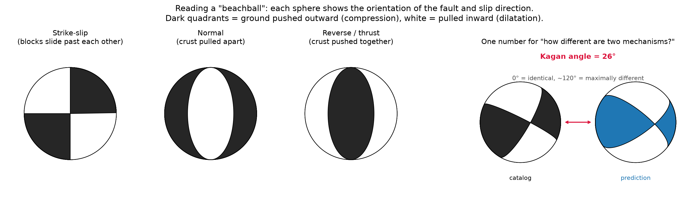
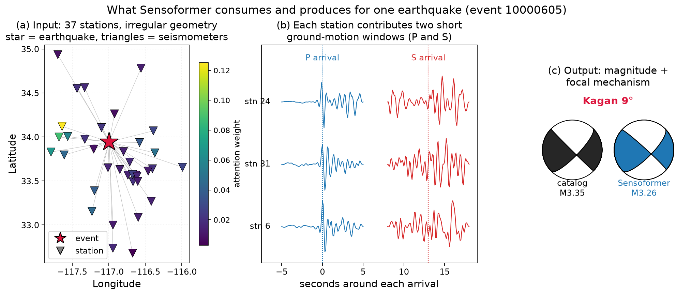
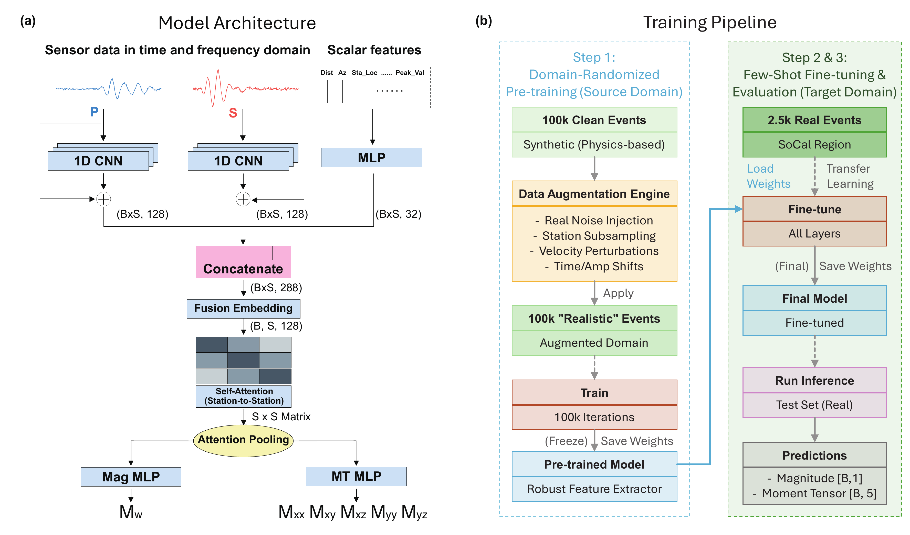
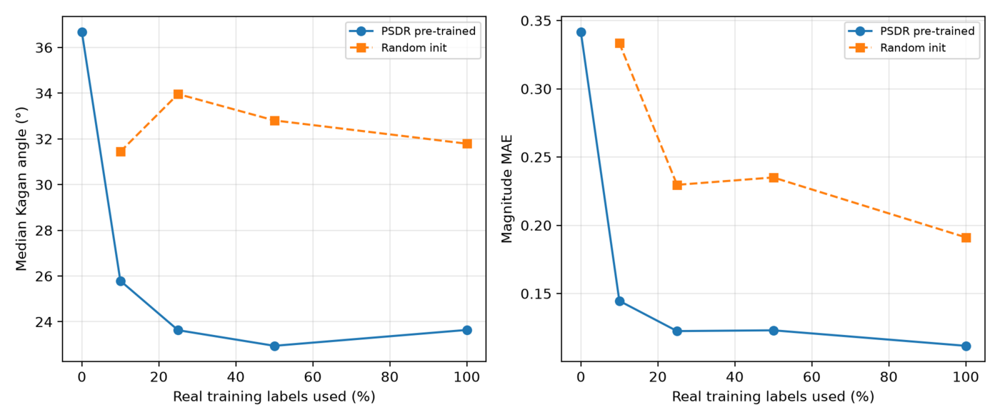
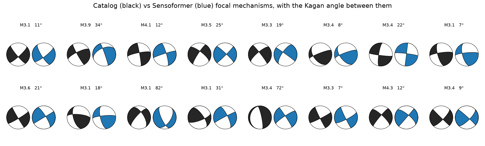
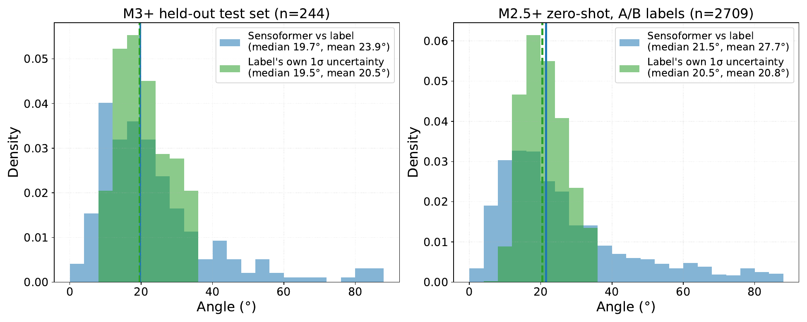
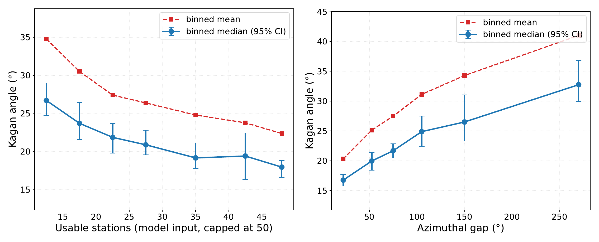
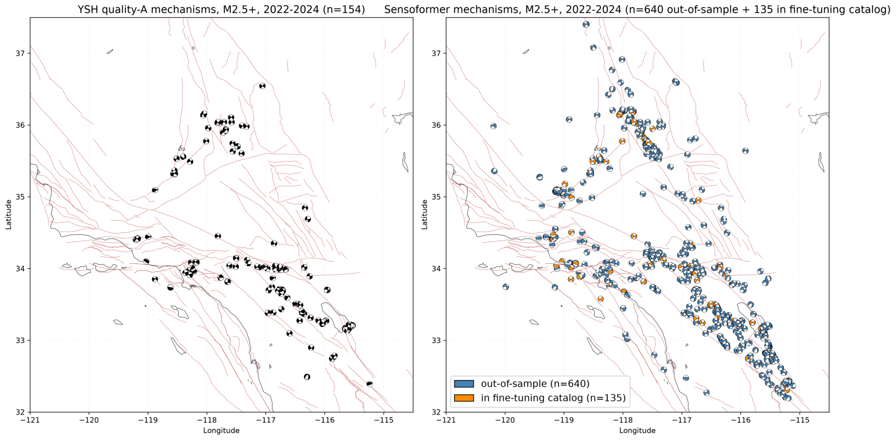

# Sensoformer

**Estimating what an earthquake did — its size and the geometry of the fault that slipped —
from whatever seismic stations happened to record it.**

[](https://www.python.org/downloads/)
[](LICENSE)
[](https://arxiv.org/abs/2601.06320)
[](https://huggingface.co/jiazhe868/sensoformer)
[](https://huggingface.co/datasets/jiazhe868/sensoformer-data)

Paper: [*Sensoformer: Robust Sim-to-Real Inference on Variable-Geometry Sensor Sets via
Physics-Structured Randomization*](https://arxiv.org/abs/2601.06320) (arXiv:2601.06320).

---

## Contents

- [1. The problem, for people new to seismology](#1-the-problem-for-people-new-to-seismology)
- [2. What the model takes in and gives back](#2-what-the-model-takes-in-and-gives-back)
- [3. How it works](#3-how-it-works)
  - [3.1 Treat the stations as a *set*](#31-treat-the-stations-as-a-set)
  - [3.2 Step 1 — encode each station on its own](#32-step-1--encode-each-station-on-its-own)
  - [3.3 Step 2 — let the stations talk to each other (attention, for newcomers)](#33-step-2--let-the-stations-talk-to-each-other-attention-for-newcomers)
  - [3.4 Step 3 — pool the set into one vector](#34-step-3--pool-the-set-into-one-vector)
  - [3.5 Closing the simulation-to-reality gap (PSDR)](#35-closing-the-simulation-to-reality-gap-psdr)
- [4. Results](#4-results)
- [5. Install](#5-install)
- [6. Usage](#6-usage)
- [7. Pretrained models and datasets](#7-pretrained-models-and-datasets)
- [8. Repository map](#8-repository-map)
- [9. Documentation](#9-documentation)
- [10. Glossary](#10-glossary)
- [11. References](#11-references)
- [12. Citation and license](#12-citation-and-license)

---

## 1. The problem, for people new to seismology

When a fault slips, it radiates seismic waves that are recorded by seismometers scattered
across a region. Two things we want to know immediately are:

- **Magnitude** (how much energy was released), and
- **the focal mechanism** — the orientation of the fault plane and the direction it slipped.

The focal mechanism is summarised by a **moment tensor**, and drawn as a "beachball": a
sphere around the earthquake, shaded where the first ground motion pushed outward and left
white where it pulled inward. The pattern of dark and white tells you the fault geometry.



Why this is hard, and why it is a nice machine-learning problem:

1. **The sensor layout is different for every event.** An earthquake might be recorded by
   11 stations or 80, in a ring around it or all on one side. There is no fixed grid and
   no fixed ordering, so the usual tricks (a CNN over an image, an RNN over a sequence)
   do not apply.
2. **The ordering is meaningless.** "Station 3" is not inherently before "station 7". A
   model must give the same answer if you shuffle the inputs — it must be
   *permutation-invariant*.
3. **Labels are scarce, so we train on simulations — and simulations lie.** We can
   generate millions of synthetic earthquakes from physics, but real seismograms are
   distorted by the messy, unmapped structure of the Earth. A model trained on clean
   simulations can be excellent on simulations and useless on real data. This is the
   **sim-to-real gap**, and handling it is the core contribution here.

Classical methods solve each event separately with an iterative physics inversion. That
works well when coverage is good, is slow, and struggles when only a handful of stations
recorded the event. Sensoformer instead learns the inverse mapping *once*, then applies it
to a new event in a single forward pass (milliseconds).

## 2. What the model takes in and gives back



For **one earthquake**, the input is a *set* of stations. Each station contributes:

- two short ground-motion windows, around the **P-wave** arrival (the first, fastest wave)
  and the **S-wave** arrival (slower, usually larger), on three components each, plus their
  frequency spectra — a `12 × 101` array in total;
- **20 numbers** describing context: how far away the station is, in which direction
  (azimuth), its coordinates, the event depth, and summary amplitudes.

The output is **6 numbers**: the magnitude, and five components of the (zero-trace,
normalized) moment tensor, from which the beachball is drawn. The model also returns the
**attention weight** it gave each station — panel (a) above is coloured by it, so you can
see which stations drove the answer.

Accuracy is scored with the **Kagan angle** [[10](#ref10)]: the single rotation angle
between the true and predicted mechanisms. 0° is perfect; two random mechanisms differ by
about 75–80° on average.

## 3. How it works



### 3.1 Treat the stations as a *set*

The architecture is built around permutation invariance. Its ancestors are **DeepSets**
[[2](#ref2)], which encode each element independently and then pool, and the **Set
Transformer** [[3](#ref3)], which lets elements interact through attention before pooling.
Sensoformer follows the second recipe, because in wave physics a single station is
genuinely ambiguous: the same wiggle can come from different fault geometries, and only
the *pattern across stations* — which directions pushed and which pulled — resolves it.

### 3.2 Step 1 — encode each station on its own

Each station's P and S windows go through **two separate 1D residual CNNs**
(ResNet-style [[5]](#ref5)), producing 128 numbers each. The 20 context
numbers go through a small MLP into 32 more. These are concatenated (288) and compressed
back to a **128-dimensional "token"** for that station.

Why two separate CNNs rather than one? P and S waves carry different, complementary
constraints. Forcing them through a shared tower measurably hurts: median Kagan error
degrades from 19.7° to 31.3°.

### 3.3 Step 2 — let the stations talk to each other (attention, for newcomers)

The 128-d tokens are passed through a **transformer encoder** [[1](#ref1)] — 3 layers,
4 attention heads, 128 dimensions.

If transformers are new to you, the mechanism in one paragraph: each token emits a
**query** ("what am I looking for?"), a **key** ("what do I offer?") and a **value**
("what I'd pass on"). Every token's query is compared against every other token's key;
the resulting scores are normalised into weights, and each token's new representation is
the weighted average of all the values. In short, **every station looks at every other
station and decides how much to listen to each one.** A station on the opposite side of
the fault can tell a nearby station something that resolves its ambiguity, and that
exchange happens directly, in one step, regardless of distance.

Two deliberate differences from a textbook transformer:

- **No positional encoding.** Language transformers add a vector encoding "this is word
  5". Here, position in the list is meaningless, so we omit it — and the layer becomes
  permutation-equivariant for free. Geometry still reaches the model, but through the
  *content* of each token (distance, azimuth, coordinates), not through its index.
- **A padding mask**, because different events have different station counts and batches
  are padded to the largest one.

### 3.4 Step 3 — pool the set into one vector

Self-attention returns one vector per station; a prediction needs one vector per event.
Instead of a plain average, a small MLP scores each station and the scores are softmaxed
into weights that sum to 1 — **attention pooling**, from attention-based multiple-instance
learning [[4](#ref4)]:

```
score_i = w₂ᵀ tanh(W₁ h_i)        a_i = softmax(score_i)        z = Σ_i a_i · h_i
```

This is where permutation-*equivariance* becomes permutation-*invariance*. It is a
different mechanism from the attention in step 2 (no key/value projections, no multiple
heads, a single learned query), and it is also what makes the model interpretable: the
`a_i` say which stations mattered. Two small MLP heads then read magnitude and moment
tensor off `z`.

Full tensor shapes, parameter counts (2,063,015 total) and the exact QKV dimensions are in
[docs/ARCHITECTURE.md](docs/ARCHITECTURE.md).

### 3.5 Closing the simulation-to-reality gap (PSDR)

Training needs far more labelled events than any real catalog contains, so stage 1 trains
on ~100,000 **synthetic** earthquakes computed with a wave-propagation code
[[13](#ref13)] on *real* station geometries. The catch from §1 is that clean synthetics
are too clean.

The standard remedy in robotics is **domain randomization** [[9](#ref9)]: randomize the
simulator so widely that reality looks like just another variation. Sensoformer's version,
**Physics-Structured Domain Randomization (PSDR)**, randomizes the *physics of the
generating process* rather than superficial features:

| Randomized | What it mimics |
| :--- | :--- |
| Earth velocity model, sampled per event from a library derived from CRUST1.0 [[14](#ref14)] | we don't know the true subsurface structure |
| Travel-time and amplitude perturbations, synthetic scattering coda | 3-D heterogeneity the simulation omits |
| Real ambient noise recorded before actual earthquakes, injected into synthetics | genuine instrument and environmental noise |
| Random dropout to 30–50 stations | telemetry gaps and varying network coverage |

Stage 2 then fine-tunes on ~1,700 real events.

**Does it work?** Three independent checks say yes:

- In embedding space, the mismatch between synthetic and real events (Maximum Mean
  Discrepancy [[16](#ref16)]) drops by **78%** (MMD² 0.721 → 0.157, p = 0.001).
- A model pre-trained on *clean* synthetics reaches 4.4° median Kagan on simulations —
  near-perfect — yet only 33.6° on real data after identical fine-tuning. With PSDR,
  19.5°. Fine-tuning cannot repair what pre-training did not learn.
- With PSDR pre-training, **10% of the real labels beat from-scratch training on 100%**.



## 4. Results

244 held-out real Southern California events (never seen in training). Full tables,
confidence intervals and ablations: [docs/RESULTS.md](docs/RESULTS.md).

| Model | Mag MAE | Mean Kagan | Median Kagan |
| :--- | :---: | :---: | :---: |
| **Sensoformer** | **0.100** | **23.9°** | **19.7°** |
| MPNN — graph neural net, GCN [[6](#ref6)] | 0.139 | 31.2° | 24.3° |
| MPNN — graph attention, GAT [[7](#ref7)] | 0.139 | 30.3° | 23.7° |
| DeepSets — pool without interaction [[2](#ref2)] | 0.140 | 35.7° | 29.1° |
| DeepONet — neural operator [[8](#ref8)] | 0.141 | 35.4° | 28.5° |
| No synthetic pre-training | 0.185 | 32.9° | 25.2° |
| MLP on pooled inputs | 0.138 | 41.9° | 38.2° |
| Linear regression | 0.494 | 41.1° | 37.0° |

Every gap to Sensoformer is statistically significant (paired bootstrap, 95% CIs exclude
zero). Example predictions — catalog in black, model in blue:



**How good is 19.7°, really?** The catalog it is compared against is itself uncertain:
analyst solutions [[11](#ref11)] carry a median 1σ nodal-plane uncertainty of ~19.5°.
The model's median error equals the label noise floor, so on typical events it is about as
close to the catalog as the catalog is to itself.



**When is it less reliable?** Error is driven by network geometry, not randomness: more
stations and better azimuthal surround mean smaller errors. Check these before trusting a
single event's solution.



**Practical payoff.** Applied to every M ≥ 2.5 event with ≥ 10 usable stations
(1992–2024), the model produces mechanisms for 2,699 earthquakes that have no reliable
analyst solution — a **+32% increase** over the reliable catalog for the same period.
Below, the same three years: analyst quality-A solutions (left) versus Sensoformer
(right), on the Southern California fault map.



## 5. Install

```bash
git clone https://github.com/jiazhe868/Sensoformer.git
cd Sensoformer
pip install -e .          # or: pip install -r requirements.txt
make build                # compile the Fortran moment-tensor kernel (needs gfortran)
make test                 # optional: ~50 unit tests
```

`make build` compiles the small Fortran routine that converts moment tensors to
strike/dip/rake and computes Kagan angles. Without it everything still runs; only those
derived quantities are skipped.

## 6. Usage

### Run the released model on prepared data

```bash
python scripts/download_assets.py --weights --datasets socal-real   # ~0.26 GB
python scripts/predict.py --input socal-real --out-dir results/demo --figures
```

`results/demo/predictions.csv` gets one row per event: magnitude, five moment-tensor
components, strike/dip/rake, and — when the input has ground truth — the Kagan angle and
magnitude error. `make demo` runs exactly this.

### From Python

```python
from sensoformer import load_pretrained

model = load_pretrained("sensoformer-v3-finetuned", device="cuda")  # cached after first call
predictions, attention = model(waveforms, features, mask)
# predictions: (B, 6) = [scaled Mw, Mxx, Myy, Mxy, Mxz, Myz];  Mw = (y + 1)/2 * 6 + 2
# attention:   (B, S) = how much the model listened to each station
```

A complete, runnable version is in [`examples/quickstart_inference.py`](examples/quickstart_inference.py).

### Your own earthquakes

Any HDF5 following [docs/DATA_FORMAT.md](docs/DATA_FORMAT.md) works, **with or without**
ground-truth labels:

```bash
python scripts/predict.py --input my_events.hdf5 --out-dir results/mine --catalog
```

Starting from raw waveform archives instead? `scripts/data_acquisition/` downloads events,
phase picks and waveforms, and `scripts/preprocessing/` turns them into the HDF5 — see
[docs/DATA_PIPELINE.md](docs/DATA_PIPELINE.md).

### Fine-tune on a new catalog or region

```bash
CKPT=$(python -c "from sensoformer.hub import resolve_checkpoint; print(resolve_checkpoint('sensoformer-v3-pretrained')[0])")

python scripts/train.py \
    model=sensoformer data=real_socal training=finetune \
    data.path=/path/to/my_catalog.hdf5 \
    training.pretrained_ckpt=$CKPT \
    training.eval_test=true training.val_size=0.1 training.test_size=0.1 \
    seed=42 device=cuda \
    hydra.run.dir=./outputs/my_finetune
```

Add `training.smoke_test=true` for a one-minute dry run first. Recipes, hyperparameters
and pitfalls: [docs/FINETUNING.md](docs/FINETUNING.md).

## 7. Pretrained models and datasets

Weights and data live on the Hugging Face Hub and download on demand. Every entry point
also accepts plain local paths, so the repo works offline.

| Registry name | What it is | Size |
| :--- | :--- | :---: |
| `sensoformer-v3-finetuned` | pre-trained **+ fine-tuned** — use this for inference | 8 MB |
| `sensoformer-v3-pretrained` | PSDR synthetic pre-training only — fine-tune from this | 8 MB |
| `socal-real` | 2,435 real SoCal events (M ≥ 3.0) with analyst mechanisms | 0.26 GB |
| `synthetic-psdr` | ~100k PSDR synthetic events on real geometries | 11.4 GB |
| `synthetic-clean` | ~50k clean synthetics (no randomization), for the ablation | 5.4 GB |
| `yhs-socal` | Yang–Hauksson–Shearer focal-mechanism catalog, 1981–2024 — the **labels** behind `socal-real` (third-party; cite [[11](#ref11)], [[19](#ref19)]) | 31 MB |

```bash
python scripts/download_assets.py --list
python scripts/download_assets.py --catalogs yhs-socal   # only needed to rebuild from raw SAC
```

The catalog is mirrored so that the real-data pipeline is reproducible from raw
waveforms; the authoritative copy is at the SCEDC [[19](#ref19)]. Its column layout
and quality grades are explained in
[docs/DATA_PIPELINE.md](docs/DATA_PIPELINE.md#the-yhs-focal-mechanism-catalog-ysh_alllog).

Details, and how to publish your own: [docs/HUGGINGFACE.md](docs/HUGGINGFACE.md).

## 8. Repository map

```text
Sensoformer/
├── src/sensoformer/
│   ├── hub.py              # weight/dataset resolution + load_pretrained()
│   ├── models/
│   │   ├── network.py          Sensoformer (set transformer + attention pooling)
│   │   ├── gnn.py              MPNN baselines (GCN and GAT message passing)
│   │   ├── deeponet.py         Neural-operator baseline
│   │   ├── simple_baselines.py Linear / MLP on pooled inputs
│   │   └── posterior_flow.py   Conditional flow for calibrated uncertainty
│   ├── data/dataset.py     # variable-station dataset + dynamic-padding collate
│   ├── utils/              # physics (Kagan angle, beachballs), losses, figures
│   └── ext/                # Fortran moment-tensor kernel (mtdcmp.f)
├── scripts/
│   ├── predict.py          # ← inference CLI
│   ├── train.py            # ← pre-training / fine-tuning (Hydra)
│   ├── download_assets.py  # fetch weights + data from the Hub
│   ├── make_readme_figures.py  # regenerate the figures in this README
│   ├── preprocessing/      # raw waveforms → model-ready HDF5
│   └── data_acquisition/   # catalog query, waveform + pick download
├── configs/                # Hydra configs (model / data / training)
├── docs/                   # see below
├── examples/               # runnable quickstart
└── tests/                  # ~50 unit and data-agreement tests
```

## 9. Documentation

| Document | Contents |
| :--- | :--- |
| [QUICKSTART.md](docs/QUICKSTART.md) | The 5-minute paths for inference and fine-tuning |
| [ARCHITECTURE.md](docs/ARCHITECTURE.md) | Exact tensor shapes, QKV dimensions, parameter counts |
| [DATA_FORMAT.md](docs/DATA_FORMAT.md) | HDF5 schema — what you need to bring your own data |
| [DATA_PIPELINE.md](docs/DATA_PIPELINE.md) | Raw waveforms → preprocessing → HDF5, both domains |
| [FINETUNING.md](docs/FINETUNING.md) | Training recipes, hyperparameters, diagnostics |
| [INFERENCE.md](docs/INFERENCE.md) | `predict.py` reference, outputs, how to read the numbers |
| [RESULTS.md](docs/RESULTS.md) | Full benchmarks, ablations, uncertainty and generalization |
| [HUGGINGFACE.md](docs/HUGGINGFACE.md) | Asset hosting; publishing new weights/datasets |
| [TROUBLESHOOTING.md](docs/TROUBLESHOOTING.md) | Known pitfalls and their fixes |

## 10. Glossary

| Term | Meaning |
| :--- | :--- |
| **P wave / S wave** | The first (compressional) and second (shear) arrivals from an earthquake. |
| **Focal mechanism** | The fault orientation and slip direction; drawn as a beachball. |
| **Moment tensor** | The 3×3 symmetric tensor describing the source; 5 independent numbers once trace-free and normalized. |
| **Strike / dip / rake** | Human-readable angles for the same thing: fault compass direction, tilt, and slip direction. |
| **Kagan angle** | The rotation angle between two focal mechanisms; the accuracy metric used here [[10](#ref10)]. |
| **Magnitude (Mw)** | Logarithmic measure of released energy. |
| **Azimuthal gap** | The largest angular wedge around an event containing no station; large gap = poorly constrained. |
| **Permutation invariance** | Output does not change when inputs are reordered. |
| **Attention** | A learned, input-dependent weighted average: each element decides how much to listen to each other element. |
| **Sim-to-real gap** | The performance drop when a model trained on simulations meets real data. |
| **Domain randomization** | Randomizing the simulator so that reality falls inside the training distribution [[9](#ref9)]. |

## 11. References

All entries below were checked against the publisher or arXiv record.

<a id="ref1"></a>[1] Vaswani, A., Shazeer, N., Parmar, N., Uszkoreit, J., Jones, L., Gomez, A. N., Kaiser, Ł., & Polosukhin, I. (2017). *Attention Is All You Need.* NeurIPS 30. [arXiv:1706.03762](https://arxiv.org/abs/1706.03762)

<a id="ref2"></a>[2] Zaheer, M., Kottur, S., Ravanbakhsh, S., Póczos, B., Salakhutdinov, R., & Smola, A. J. (2017). *Deep Sets.* NeurIPS 30. [arXiv:1703.06114](https://arxiv.org/abs/1703.06114)

<a id="ref3"></a>[3] Lee, J., Lee, Y., Kim, J., Kosiorek, A. R., Choi, S., & Teh, Y. W. (2019). *Set Transformer: A Framework for Attention-based Permutation-Invariant Neural Networks.* ICML, PMLR 97:3744–3753. [arXiv:1810.00825](https://arxiv.org/abs/1810.00825)

<a id="ref4"></a>[4] Ilse, M., Tomczak, J. M., & Welling, M. (2018). *Attention-based Deep Multiple Instance Learning.* ICML, PMLR 80:2132–2141. [arXiv:1802.04712](https://arxiv.org/abs/1802.04712)

<a id="ref5"></a>[5] He, K., Zhang, X., Ren, S., & Sun, J. (2016). *Deep Residual Learning for Image Recognition.* CVPR, 770–778. [arXiv:1512.03385](https://arxiv.org/abs/1512.03385)

<a id="ref6"></a>[6] Kipf, T. N., & Welling, M. (2017). *Semi-Supervised Classification with Graph Convolutional Networks.* ICLR. [arXiv:1609.02907](https://arxiv.org/abs/1609.02907)

<a id="ref7"></a>[7] Veličković, P., Cucurull, G., Casanova, A., Romero, A., Liò, P., & Bengio, Y. (2018). *Graph Attention Networks.* ICLR. [arXiv:1710.10903](https://arxiv.org/abs/1710.10903)

<a id="ref8"></a>[8] Lu, L., Jin, P., Pang, G., Zhang, Z., & Karniadakis, G. E. (2021). *Learning nonlinear operators via DeepONet based on the universal approximation theorem of operators.* Nature Machine Intelligence, 3(3), 218–229. [doi:10.1038/s42256-021-00302-5](https://doi.org/10.1038/s42256-021-00302-5)

<a id="ref9"></a>[9] Tobin, J., Fong, R., Ray, A., Schneider, J., Zaremba, W., & Abbeel, P. (2017). *Domain Randomization for Transferring Deep Neural Networks from Simulation to the Real World.* IEEE/RSJ IROS, 23–30. [arXiv:1703.06907](https://arxiv.org/abs/1703.06907)

<a id="ref10"></a>[10] Kagan, Y. Y. (1991). *3-D rotation of double-couple earthquake sources.* Geophysical Journal International, 106(3), 709–716. [doi:10.1111/j.1365-246X.1991.tb06343.x](https://doi.org/10.1111/j.1365-246X.1991.tb06343.x)

<a id="ref11"></a>[11] Yang, W., Hauksson, E., & Shearer, P. M. (2012). *Computing a Large Refined Catalog of Focal Mechanisms for Southern California (1981–2010): Temporal Stability of the Style of Faulting.* Bulletin of the Seismological Society of America, 102(3), 1179–1194. [doi:10.1785/0120110311](https://doi.org/10.1785/0120110311)

<a id="ref12"></a>[12] Hardebeck, J. L., & Shearer, P. M. (2002). *A New Method for Determining First-Motion Focal Mechanisms.* Bulletin of the Seismological Society of America, 92(6), 2264–2276. [doi:10.1785/0120010200](https://doi.org/10.1785/0120010200)

<a id="ref13"></a>[13] Zhu, L., & Rivera, L. A. (2002). *A note on the dynamic and static displacements from a point source in multilayered media.* Geophysical Journal International, 148(3), 619–627. [doi:10.1046/j.1365-246X.2002.01610.x](https://doi.org/10.1046/j.1365-246X.2002.01610.x)

<a id="ref14"></a>[14] Laske, G., Masters, G., Ma, Z., & Pasyanos, M. (2013). *Update on CRUST1.0 — A 1-degree Global Model of Earth's Crust.* Geophysical Research Abstracts, 15, EGU2013-2658.

<a id="ref15"></a>[15] Aki, K., & Richards, P. G. (2002). *Quantitative Seismology*, 2nd edition. University Science Books.

<a id="ref16"></a>[16] Gretton, A., Borgwardt, K. M., Rasch, M. J., Schölkopf, B., & Smola, A. (2012). *A Kernel Two-Sample Test.* Journal of Machine Learning Research, 13, 723–773.

<a id="ref17"></a>[17] Cranmer, K., Brehmer, J., & Louppe, G. (2020). *The frontier of simulation-based inference.* PNAS, 117(48), 30055–30062. [doi:10.1073/pnas.1912789117](https://doi.org/10.1073/pnas.1912789117)

<a id="ref18"></a>[18] Vovk, V., Gammerman, A., & Shafer, G. (2005). *Algorithmic Learning in a Random World.* Springer.

<a id="ref19"></a>[19] Southern California Earthquake Data Center (SCEDC), California Institute of Technology. Waveform and catalog data source. <https://scedc.caltech.edu>

## 12. Citation and license

```bibtex
@article{jia2026sensoformer,
  title   = {Sensoformer: Robust Sim-to-Real Inference on Variable-Geometry
             Sensor Sets via Physics-Structured Randomization},
  author  = {Jia, Zhe and Zhang, Xiaotian and Li, Junpeng},
  journal = {arXiv preprint arXiv:2601.06320},
  year    = {2026}
}
```

Machine-readable metadata: [CITATION.cff](CITATION.cff). Released under the MIT
[LICENSE](LICENSE). Real waveform and catalog data courtesy of SCEDC [[19](#ref19)];
please cite the data source and the mechanism catalog [[11](#ref11)] alongside this work.
